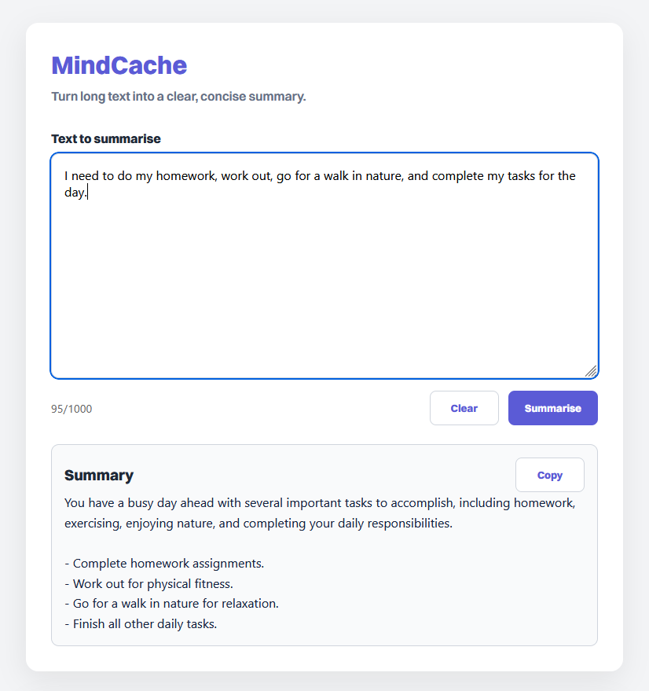
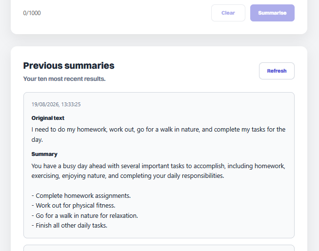
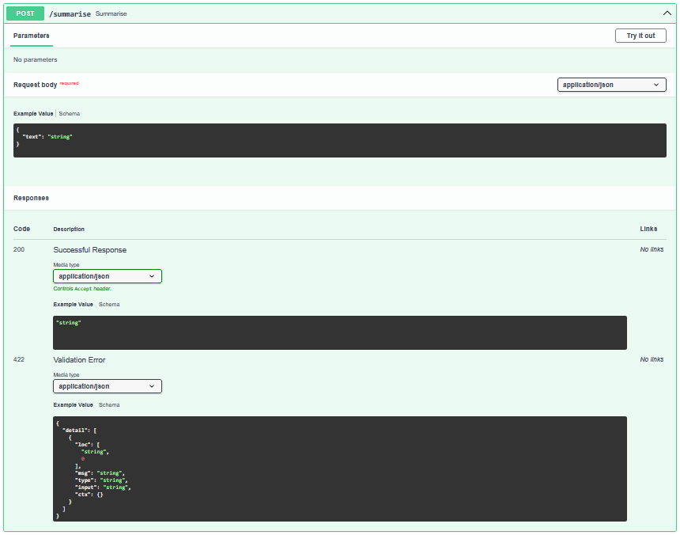

# MindCache

_An AI-powered personal knowledge system using LLM summarisation, embeddings, and semantic retrieval_

## Overview

MindCache is a production-minded AI summary service that consists of a backend service built with FastAPI that accepts text input, generates a concise AI-powered summary, stores the result in a PostgreSQL database, and exposes endpoints for retrieving previous summaries.

This project was created to practise building a realistic backend system using modern tools such as Docker, PostgreSQL, SQLAlchemy, and environment-based configuration.

Personally, I wanted to take my Python skills to the next level, experiment with RESTful APIs, and learn containerisation and legimiate  deployment.

## Screenshots

### Main Interface


### Generated Summary


### API
###### _Summary Enpoint_


## Features

- Summarise text using an AI model
- Store generated summaries in PostgreSQL
- Retrieve summary history
- Input validation and request limits
- Basic rate limiting
- Error handling for invalid inputs and failed AI calls
- Dockerised FastAPI and PostgreSQL services
- Persistent databse storage using Docker volumes
- Environment variable configuration for secrets
- Basic API key protection

## Tech Stack


## Architecture

```text
    Client / Swagger UI
            |
            v
        FastAPI Backend
            |
            |----> OpenAI API
            |
            v
        PostgreSQL Database
```
<!-- Replace with proper diagram later. -->

## API Endpoints

| Method | Endpoint | Description |
|-|-|-|
| GET | `/` | Basic API status message |
| GET | `/health` | Health check |
| POST | `/summarise` | Summarises text sand stores the result |
| GET | `/history` | Returns previous summaries |

## Example

### Request
```http
POST /summarise
Content-Type: application/json
```

### Response
```json
{
  "text": "Paste text to summarise here..."
}
```

## Project Structure

```text
ai-summary-api/
│
├── backend/
│   ├── src/
│   │   ├── __init__.py
│   │   ├── main.py
│   │   ├── database.py
│   │   ├── models.py
│   │   └── config.py
│   ├── requirements.txt
│   ├── Dockerfile
│   ├── docker-compose.yml
│   ├── .env.example
│   └── .dockerignore
│
├── frontend/
│   ├── src/
│   │   ├── assets/fonts
│   │   ├── App.tsx
│   │   ├── App.css
│   │   └── index.css
│   ├── .env.example
│   └── [Vite + React Components]
│
├── .gitignore
├── .gitattributes
└── README.md
```

## Environment Variables

Create a `.env` files in the project root.

```env
APP_API_KEY=your_app_api_key_here
OPENAI_API_KEY=your_openai_key_here
POSTGRES_USER=postgres
POSTGRES_PASSWORD=pass
POSTGRES_DB=summarydb
POSTGRES_HOST=db
POSTGRES_PORT=5432
```

Do not commit this file.

Use `.env.example` as the template for it.

## Running Locally with Docker

Make sure Docker Desktop is running.

Build and start the service:
```bash
docker compose up --build
```

The API should then be available at:
```
http://localhost:8000
```

FastAPI interactive docs:
```
http://localhost:8000/docs
```

To stop the containers:
```
docker compose down
```

To stop containers and remove the database volume:
```
docker compose down -v
```
> [!WARNING]
> Using `-v` deletes the persisted PostgreSQL data.

## What I Learned

- How FastAPI routes map HTTP requests to Python functions
- How PostgreSQL stores application data
- How SQLAlchemy sessions are used to insert and query records
- How Docker Compose runs multiple services together
- Why environment variables are important for secret management
- Why persistent volumes are needed for database containers
- How health checks prevent the API from starting before the database is ready

## Current Limitations

- Rate limiting is currently in-memory and resets when the API restarts
- Full authentication is not yet implemented
- The API currently supports text summarisation only
- Database migrations are not yet managed

## Future Improvements

- Deploy the service to AWS
- Add proper user authentication
- Add summary modes such as short, detailed, and bullet-point summaries
- Add tagging or search for saved summaries
- Improve rate limiting using Redis or an API gateway
- Add automated tests

## Status

> This project has reached the end of `v1`.

